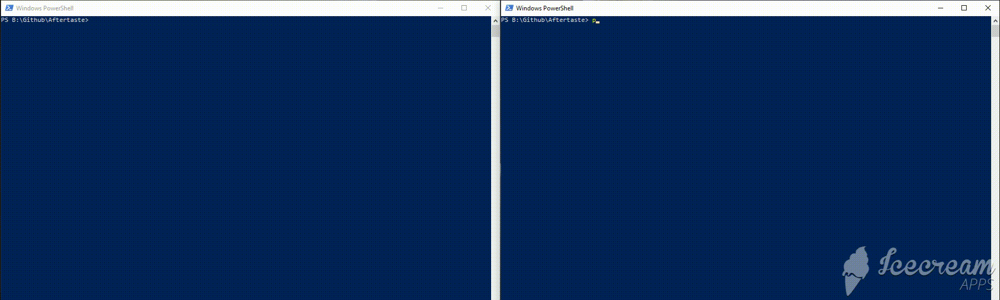
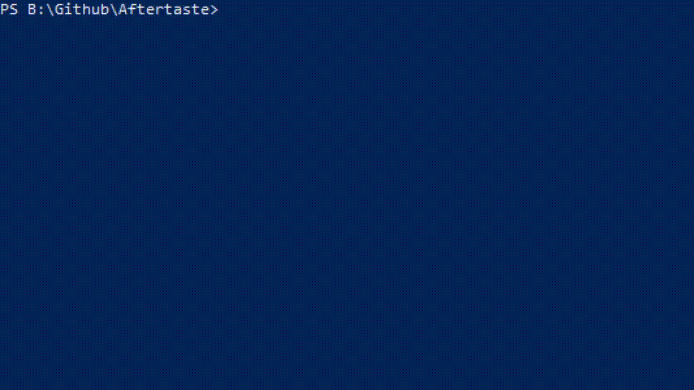

# Aftertaste

Aftertaste is a python-based reverse shell with numerous tools for educational purposes. It allows arbitrary command execution of a client's machine, keystroke logging, and registry edits.




# Features

- Arbitrary command execution
- AES-128 bit key encryption between client and server packets
- Automatically places client into the startup registry on first launch
- Windows registry key manipulation
- Keystroke logging
- Encrypted file transfer between server and client

### Environment
| Operating System | Client | Server |
| ------ | ------ | ------ |
| Windows 10 | ✔ | ✔|
| Windows 8.1 | ✔ | ✔ |
| Ubuntu | ✘ | ✔|

Python 3.6+

### Installation

Install [python 3.6](https://www.python.org/downloads/release/python-369/) to be able to run the server

Install the python dependencies from the master branch

```sh
$ pip install -r requirements.txt
```

# Usage
### Running the client
Edit ./settings/keys.py to change the server's ip address and password

>CONN_IP_ADDRESS = "127.0.0.1"

>CONN_PASSWORD = "password"

>CONN_PORT=5000

Compile client.py on windows by running build.bat
```sh
$ .\build.bat
```
The exe file will be in the dist folder

Run the exe on the target machine

Running the exe file the first time will copy itself into the folder:
>C:\\Users\\%user%\\AppData\\Local\\


### Server usage
Run server.py using python
```sh
$ python3 server.py
```

Once a client successfully connects to the server, list all current open connections using:
```sh
LST
```
Choose a connection 
```sh
CHS 0
```
Issue command line commands using
```sh
CMD [shell command]
```

### Server Commands
```
CMD :param:                         - Executes a windows shell command on a target's machine

EXE :param:                         - Executes pre-created features. Example programs:
    keylogger :param1:              - Starts the keylogger.
                                    - param1 is the filename to store the data
    placestartup :param1: :param2:  - Places a file into the startup registry (So it will run on startup)
                                    - param1 is the registry key name
                                    - param2 is the path to the file
    removestartup :param1:          - Removes the file from the startup registry
                                    - param1 is the registry key

FTP :param:                         - Transfers a file from the server to the target machine
                                    - param is the path to the file relative to the current directory

RFTP :param:                        - Transfer a file from the client to the server
                                    - param is the path of the file relative to the client directory
DEL                                 - Deletes the exe and removes the windows registry key from the target machine

EXT                                 - Turns off the client from the target machine

LST                                 - List all current client connections that has connected to the server

CHS :param:                         - Choose the current connection
                                    - param is the number associated with the connection (Use LST to list connections)

SGN                                 - Signs the server out from the client (breaks the connection)

CHK                                 - Checks the server if it currently has a chosen connection

HLP                                 - Lists the help
```

